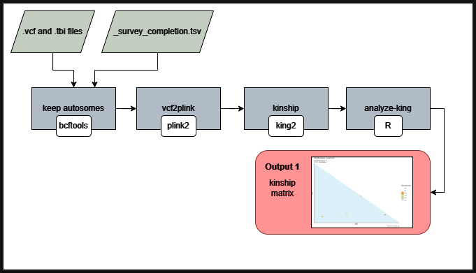

# origen-vcf2kinship
NF pipeline to estimate kinship coefficients with King2 for all pairwise relationships in the origen data

### Workflow overview


===  

- A tool for finding related samples in VCF files

- This pipeline is meant to reproduce the results in: TO-DO-add url and doi after paper is published

The pipeline takes as INPUT a VCF and .tbi file created by joint genotyping, with ONLY SNPs (No indels), and a survey data completion indicating a fraction (0 to 1), to plot this value in the closely related samples, to help make a decission in case one has to be chosen for some downstream analysis. The end result is a set of plots (and posibly a table) indicating a set of related samples, for you to make downstream decisions.

'vcf2kin' is a pipeline tool that takes variant data in VCF format and process it to generate the followin plots:  
For ONE VCF and .tbi pair of files
1) 1_allsamples.png                    # Shows all the inferred relations from PO(parent-offspring), FS(FullSiblings), 2nd, 3rd, 4th degree, and UNrelate.
2) 2_related_samples.png               # same as 1, but only showing samples with at least 1(one) relation of any type.
3) 3_types_of_pair.png                 # Summary of the type of relations found.
4) 4_close_pairs.png                   # Same as 3, but only for PO, FS, or 2nd relations
5) 5_samples_realtion_and_survey.png   # Number of relations by sample with PO,FS or at least 2nd. Also shows number of questionare completion.

---

### Features
  **-v 0.0.1**

* Supports VCF and .tbi files ##fileformat=VCFv4.2
* Results include plots that identify the related samples
* Scalability and reproducibility via a Nextflow-based framework   

---

## Requirements
#### Compatible OS*:
* [Ubuntu 22.04.4 LTS](https://releases.ubuntu.com/focal/)

#### Incompatible OS*:
* UNKNOWN  

\* origen-vcf2kinship may run in other UNIX based OS and versions, but testing is required.  

#### Command line Software required:
| Requirement | Version  | Required Commands * |
|:---------:|:--------:|:-------------------:|
| [Nextflow](https://www.nextflow.io/docs/latest/getstarted.html) | 24.04.3 | nextflow |
| [bcftools](https://anaconda.org/bioconda/bcftools) | 1.20 | bcftools |
| [plink2](https://anaconda.org/bioconda/plink2) | v2.00a5.12LM | plink2 |
| [King](https://anaconda.org/bioconda/king) | 2.2.7 | king |
| [R](https://www.r-project.org/) | 4.4.1 (2024-06-14) | Rscript |

\* These commands must be accessible from your `$PATH` (*i.e.* you should be able to invoke them from your command line).  

#### R packages required:

```
vroom version: 1.6.5
dplyr version: 1.1.4
ggplot2 version: 3.5.1
ggsci version: 3.2.0
patchwork version: 1.2.0
tidyverse version: 2.0.0
scales version: 1.4.0
ggtern version: 3.5.0
```

---

### Installation
Download pipeline from Github repository:  
```
git clone git@github.com:Iaguilaror/origen-vcf2kinship.git
```

---

## Replicate our analysis (Testing the pipeline):

* Estimated test time:  **3 minute(s)**  

1. To test pipeline execution using test data, run:  
```
./runtest.sh
```

2. Your console should print the Nextflow log for the run, once every process has been submitted, the following message will appear:  
```
======
 Basic pipeline TEST SUCCESSFUL
======
```

3. Pipeline results for test data should be in the following directory:  
```
./test/results/
```
---


### Pipeline Inputs

* A directory containing a `.vcf.gz file and .vcf.gz.tbi index` with genotypes of multiple samples.

Example contents  
```
##fileformat=VCFv4.2
##FILTER=<ID=PASS,Description="All filters passed">
##ALT=<ID=NON_REF,Description="Represents any possible alternative allele at this location">
##FILTER=<ID=LowQual,Description="Low quality">
...
CHROM  POS     ID      REF     ALT     QUAL    FILTER  INFO    FORMAT  NA19648 NA19649 NA19651 NA19652       NA19654 NA19655 NA19657 NA19658 NA19660 NA19661 NA19663 NA19664 NA19669 NA19670 NA19676 NA19678       NA19679 NA19681 NA19682 NA19684 NA19716 NA19717 NA19719 NA19720 NA19722 NA19723 NA19725 NA19726       NA19728 NA19729 NA19731 NA19732 NA19734 NA19735 NA19740 NA19741 NA19746 NA19747 NA19749 NA19750       NA19752 NA19755 NA19756 NA19758 NA19759 NA19761 NA19762 NA19764 NA19770 NA19771 NA19773 NA19774       NA19776 NA19777 NA19779 NA19780 NA19782 NA19783 NA19785 NA19786 NA19788 NA19789 NA19792 NA19794       NA19795
chr1    10150   .       C       T       .       PASS    AF=0.0109375;AN=14;AC=1;MAF=0.0145278   GT   ./.      ./.     ./.     ./.     ./.     0/0     0/0     0/0     ./.     ./.     ./.     ./.     ./.  ./.      ./.     ./.     ./.     ./.     0/0     ./.     ./.     ./.     ./.     ./.     ./.     ./.  ./.      ./.     ./.     ./.     ./.     ./.     ./.     ./.     ./.     0/0     ./.     ./.     0/0  0/1      ./.     ./.     ./.     ./.     ./.     ./.     ./.     ./.     ./.     ./.     ./.     ./.  ./.      ./.     ./.     ./.     ./.     ./.     ./.     ./.     ./.     ./.     ./.     ./.     ./.
chr1    10327   .       T       C       .       PASS    AF=0.250478;AN=34;AC=9;MAF=0.212662     GT   0/0      ./.     0/1     1/1     ./.     ./.     ./.     0/1     ./.     ./.     0/0     ./.     ./.  ./.      ./.     ./.     ./.     ./.     ./.     ./.     ./.     ./.     ./.     ./.     1/1     ./.  ./.      ./.     0/1     ./.     0/0     ./.     ./.     0/1     ./.     0/0     ./.     ./.     ./.  0/0      0/1     ./.     0/0     ./.     ./.     ./.     ./.     0/0     ./.     0/0     ./.     0/0  ./.      ./.     ./.     ./.     ./.     ./.     ./.     ./.     0/0     ./.     ./.     ./.     ./.
...
```  

* A `*_survey_completion.tsv` file with a sample ID (same as original VCF) an a completion col (from 0 to 100).

Example contents  
```
ID      completion
NA19648 72
NA19649 67
...
```  
---

### Pipeline Results

Inside the directory test/results/03-plotking you can find the following:

1) 1_allsamples.png                    # Shows all the inferred relations from PO(parent-offspring), FS(FullSiblings), 2nd, 3rd, 4th degree, and UNrelate.
2) 2_related_samples.png               # same as 1, but only showing samples with at least 1(one) relation of any type.
3) 3_types_of_pair.png                 # Summary of the type of relations found.
4) 4_close_pairs.png                   # Same as 3, but only for PO, FS, or 2nd relations
5) 5_samples_realtion_and_survey.png   # Number of relations by sample with PO,FS or at least 2nd. Also shows number of questionare completion.   

---

### module directory structure

````
.
├── dev_notes/      # includes development notes like the png for the workflow
├── main.nf         # the Nextflow main script
├── modules/        # sub-dirs for development of the Nextflow modules
├── README.md       # This readme
├── runtest.sh      # bash script to launch the pipeline test locally
├── scripts/        # directory with all the scripts used by the pipeline
└── test
    └── data       # sample data to run this pipeline
    └── reference  # sample survey data completion to test this pipeline

````

---
### References
Under the hood Proteomic compare uses some coding tools, please include the following ciations in your work:

* Di Tommaso, P., Chatzou, M., Floden, E. W., Barja, P. P., Palumbo, E., & Notredame, C. (2017). Nextflow enables reproducible computational workflows. Nature Biotechnology, 35(4), 316–319. doi:10.1038/nbt.3820

* Team, R. C. (2017). R: a language and environment for statistical computing. R Foundation for Statistical Computing, Vienna. http s. www. R-proje ct. org.

* Wickham H, Averick M, Bryan J, Chang W, McGowan LD, François R, Grolemund G, Hayes A, Henry L, Hester J, Kuhn M, Pedersen TL, Miller E, Bache SM, Müller K, Ooms J, Robinson D, Seidel DP, Spinu V, Takahashi K, Vaughan D, Wilke C, Woo K, Yutani H (2019). “Welcome to the tidyverse.” Journal of Open Source Software, 4(43), 1686. doi:10.21105/joss.01686.

* Danecek, Petr, et al. "Twelve years of SAMtools and BCFtools." Gigascience 10.2 (2021): giab008.

* Purcell, Shaun, et al. "PLINK: a tool set for whole-genome association and population-based linkage analyses." The American journal of human genetics 81.3 (2007): 559-575.

* Manichaikul, Ani, et al. "Robust relationship inference in genome-wide association studies." Bioinformatics 26.22 (2010): 2867-2873.


---

### Contact
If you have questions, requests, or bugs to report, open an issue in github, or email <iaguilaror@gmail.com>

### Dev Team
Israel Aguilar-Ordonez <iaguilaror@gmail.com>   

### Cite us
- TO-DO
